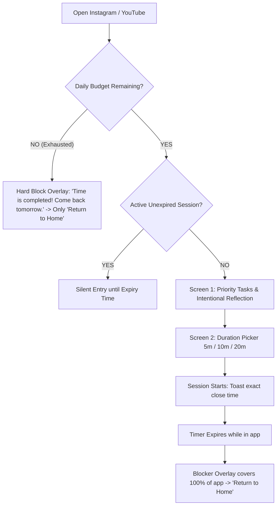

# FocusGuard: Notion Priority Tasks & Blocker Overlay Design

**Date:** 2026-09-26  
**Status:** Validated & Approved  
**Related Reference:** `extension_for_notion_0.1` (Chrome Extension)

---

## 1. Executive Summary

FocusGuard is an intentional screen time guard on Android that gates addictive apps (Instagram, YouTube) behind:
1. **Screen 1 — Priority Reflection**: Displays the top 3 high-priority tasks from Notion, with an interactive review/checkbox and a 10-second reflection pause (button initially disabled without visible countdown timer, matching the Chrome extension).
2. **Screen 2 — Duration Picker**: Offers quick preset chips (`5m`, `10m`, `20m`), daily budget status, and clock closing time preview.
3. **Screen 3 — Full-Screen Blocker**: When the session or daily budget ends, an opaque fullscreen overlay covers 100% of the app, offering only a single button: `"Return to Home Screen"`.

---

## 2. Architecture & Flow

---

## 3. Detailed Component Specifications

### 3.1. Screen 1: Priority Tasks & Intentional Reflection (`ChecklistScreen.kt`)
* **Task Card List**: Displays top 3 incomplete tasks fetched from Notion, sorted by Priority (`High` / `Urgent` > `Medium` > `Low` > Default).
* **Interactive Checkbox**: Checking off a task strikes through the title and updates Notion in the background.
* **10-Second Reflection Pause**:
  * Button text: `"Proceed to Timer ➔"`.
  * Initially disabled (`enabled = false`) for exactly 10 seconds.
  * No countdown text shown on the button (matching `extension_for_notion_0.1`).
  * After 10 seconds, enables automatically for the user to proceed.
* **Exit Button**: `"Exit to Home"` is always clickable, immediately returning the user to the device launcher.

### 3.2. Screen 2: Duration Picker (`TimePickerScreen.kt`)
* **Preset Chips**: `5m`, `10m`, `20m` (capped by remaining daily budget).
* **Budget Badge**: Shows remaining daily budget (e.g. `● 45 min left in today's budget`).
* **Touch Stepper**: `[−] 10 min [+]` allows fine-tuning in 1-minute increments without keyboard input.
* **Preview Action Button**: `"Unlock until [Exact Time e.g. 10:25 PM] ➔"`.
* **Cancel Button**: Returns to launcher.

### 3.3. Screen 3: Blocker Overlay (`BlockScreen.kt`)
* **Full-Screen Coverage**: 100% opaque dark canvas (`0xFF090D16`), covering status and navigation bars.
* **Hard Block Mode** (Daily Budget Depleted):
  * Icon: 🔒
  * Title: `[App Name] is Locked`
  * Subtitle: `Time is completed! Come back tomorrow.`
  * Only Action: `[Return to Home Screen]`.
  * Optional: One-time 5-minute emergency pass if available.
* **Session Finished Mode** (Planned Session Elapsed):
  * Icon: ⏱️
  * Title: `Session Complete!`
  * Subtitle: `Your planned focus session on [App Name] has ended.`
  * Only Action: `[Return to Home Screen]`.

---

## 4. Notion Data Flow & Integration (`NotionRepository.kt`)

* **Query Endpoint**: `POST https://api.notion.com/v1/databases/{database_id}/query` with `Notion-Version: 2022-06-28`.
* **Filter Criteria**:
  * Status property not equal to `"Done"` or `"Completed"`.
  * Checkbox property not equal to `true`.
* **Priority Sorting**:
  * Priority property (`High` / `Urgent` = rank 1, `Medium` = rank 2, `Low` = rank 3, unspecified = rank 4).
  * Slice the first 3 items.
* **Local Caching**: Saved in Room DB `notion_tasks`. Instant zero-latency render on app launch; background sync updates cache.
* **Check Sync**: When checked, `PATCH https://api.notion.com/v1/pages/{page_id}` updates status/checkbox in Notion.

---

## 5. Keyboard & Lifecycle Safety (`OverlayManager.kt` & `FocusGuardAccessibilityService.kt`)

* **FLAG_NOT_FOCUSABLE**: Ensures the overlay does not trap IME input or conflict with Android WindowManager.
* **Immediate Teardown on Package Exit**: When user leaves a monitored app (`newPkg != monitoredApp`), `overlayManager.hideAll()` is invoked immediately via `removeViewImmediate()`, guaranteeing no orphan overlays block keyboard or gestures.
* **Restart Resilience**: Daily usage and session expiration timestamps (`sessionExpiresAtMillis`) are persisted in Room DB, surviving service reboots.
